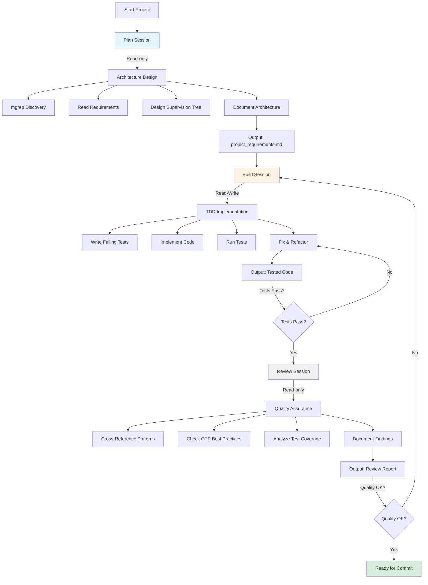
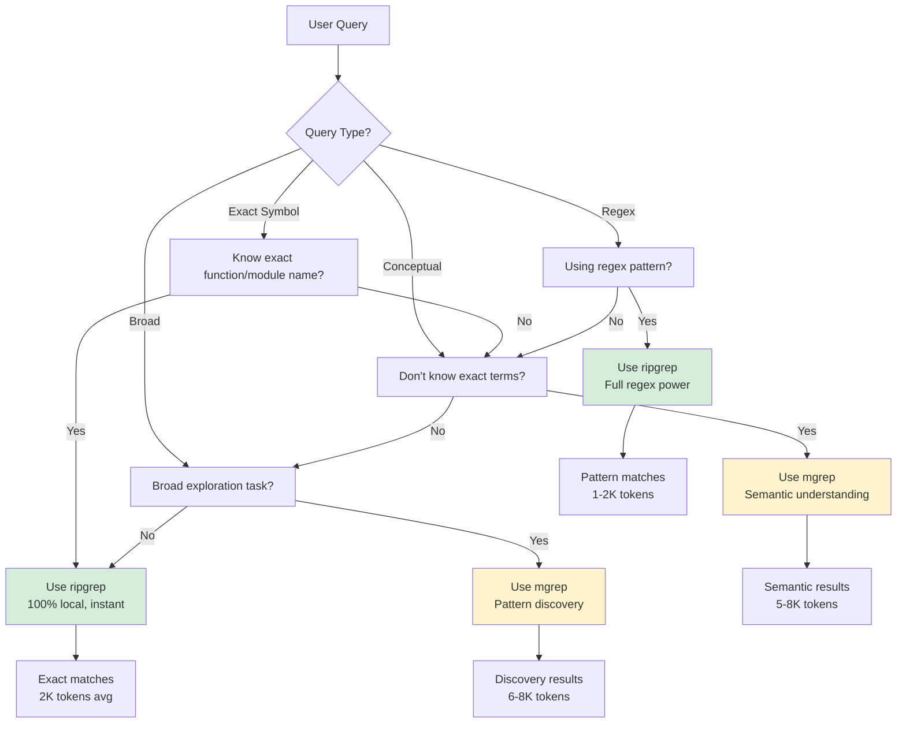
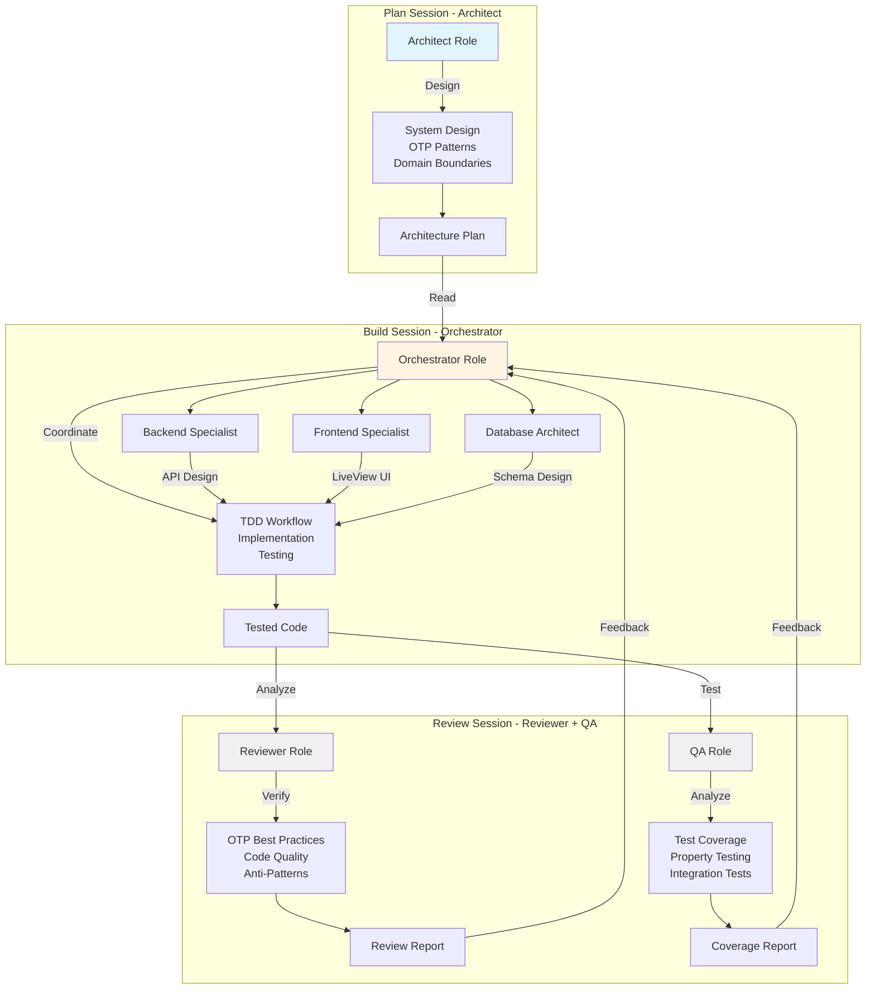
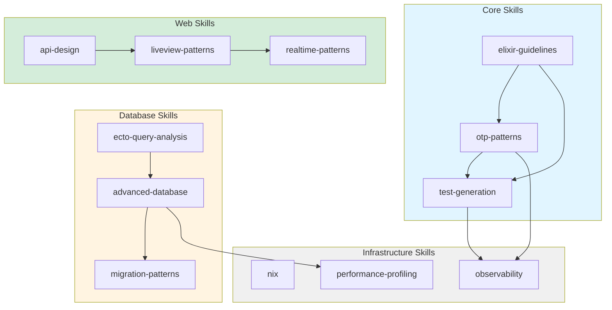
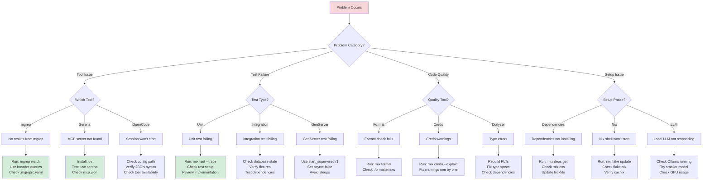

# ai-rules Workflow Diagrams

**Purpose**: Visual diagrams for better onboarding and understanding of ai-rules workflows

**Last Updated**: 2026-02-19

---

## 1. Multi-Session Workflow

---

## 2. Tool Selection Decision Tree

---

## 3. Role Interaction Diagram

---

## 4. TDD Workflow Diagram

```mermaid
graph LR
    Start[Feature Request] --> Red[Red Phase]
    
    Red --> |Write| WriteTest[Write Failing Test]
    WriteTest --> |Run| TestFails[Test Fails ✓]
    
    TestFails --> Green[Green Phase]
    Green --> |Implement| WriteCode[Write Minimal Code]
    WriteCode --> |Run| TestPasses[Test Passes ✓]
    
    TestPasses --> Refactor[Refactor Phase]
    Refactor --> |Improve| RefactorCode[Refactor Code]
    RefactorCode --> |Run| TestsStillPass[Tests Still Pass ✓]
    
    TestsStillPass --> |More Tests?| MoreTests{More Tests Needed?}
    MoreTests --> |Yes| Red
    MoreTests --> |No| Complete[Feature Complete]
    
    style Red fill:#f8d7da
    style Green fill:#d4edda
    style Refactor fill:#fff3cd
    style Complete fill:#d4edda
```

---

## 5. Git Workflow Diagram

---

## 6. Skill Dependency Map

---

## 7. Troubleshooting Flowchart

---

## 8. Directory Structure Map

```mermaid
graph TB
    Root[ai-rules/] --> Roles[roles/]
    Root --> Skills[skills/]
    Root --> Patterns[patterns/]
    Root --> Tools[tools/]
    Root --> Templates[templates/]
    Root --> Docs[docs/]
    Root --> Configs[configs/]
    Root --> Scripts[scripts/]
    
    Roles --> R1[architect.md]
    Roles --> R2[orchestrator.md]
    Roles --> R3[reviewer.md]
    Roles --> R4[qa.md]
    
    Skills --> S1[otp-patterns/]
    Skills --> S2[ecto-query-analysis/]
    Skills --> S3[test-generation/]
    Skills --> S4[observability/]
    
    Patterns --> P1[otp_supervisor.md]
    Patterns --> P2[genserver.md]
    Patterns --> P3[liveview.md]
    Patterns --> P4[exunit_testing.md]
    
    Tools --> T1[opencode/]
    Tools --> T2[claude/]
    Tools --> T3[cursor/]
    
    Templates --> TM1[phoenix-ash-liveview/]
    Templates --> TM2[elixir-library/]
    Templates --> TM3[nerves/]
    
    Docs --> D1[quickstart-agents.md]
    Docs --> D2[mixed-search-strategy.md]
    Docs --> D3[PROJECT_INIT.md]
    
    Configs --> C1[project_requirements.md]
    Configs --> C2[opencode_mcp.json]
    Configs --> C3[nix_flake_template.nix]
    
    Scripts --> SC1[init_project.sh]
    Scripts --> SC2[setup_opencode.sh]
    Scripts --> SC3[validate_requirements.sh]
    
    style Root fill:#e1f5ff
    style Roles fill:#fff4e1
    style Skills fill:#d4edda
    style Patterns fill:#f0f0f0
```

---

## Usage

These diagrams are referenced in:
- `docs/quickstart-agents.md` - Quick reference for agents
- `PROJECT_INIT.md` - Onboarding guide
- `README.md` - Project overview

To view these diagrams:
1. **GitHub**: Automatically renders Mermaid diagrams
2. **VS Code**: Install "Markdown Preview Mermaid Support" extension
3. **Online**: Use [Mermaid Live Editor](https://mermaid.live/)
4. **Docs**: Convert to images with `mmdc` CLI tool

---

## Diagram Maintenance

When adding new diagrams:
1. Follow Mermaid syntax: https://mermaid.js.org/
2. Keep diagrams under 50 nodes for readability
3. Use consistent color scheme
4. Add to this file and reference from relevant docs
5. Test rendering in GitHub before committing

---

**Last Updated**: 2026-02-19
